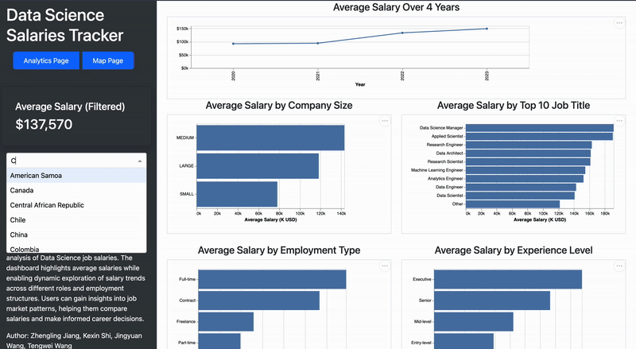

# Data Science Salaries Tracker

## DSCI-532-2025-21

### Author: Zhengling Jiang, Kexin Shi, Jingyuan Wang, Tengwei Wang

## Summary
Choosing a career in data science can be challenging, especially when it comes to understanding salary expectations across different job titles, locations, and experience levels. To address this challenge, we propose building a data visualization app that allows users to explore salary trends in the data science field. Our app will present salary distributions based on factors such as company size, experience level, and geographical location. Users will be able to filter, sort, and compare different variables to identify trends and better understand what factors contribute to higher salaries in data science.

## Motivation
Our goal is to create an easy-to-use, interactive dashboard that enables job seekers, students, and industry professionals to explore salary trends visually and understand the key factors influencing pay.


## Usage

### Demo GIF
Take a look at our demo:



### Dashboard
Try the live demo::

https://dsci-532-2025-21-ds-salaries.onrender.com/ 

### Developer Guide

1. Clone the git repository from GitHub

In your terminal, please run the following command:

```bash
git clone https://github.com/UBC-MDS/DSCI-532_2025_21_DS_Salaries.git
```

2.  Conda environment setup

To set up the necessary packages for running the code, you need to create a virtual environment by using conda with the environment file under the root directory:

```bash
conda env create --file environment.yaml
```

3.  Running the dash app locally

You can run the dash app by typing 
``` bash
python src/app.py
```

You can view the dash app by navigating to the address ``http://127.0.0.1:8050/`` in your browser.


## License

- The project code is licensed under the [MIT License](https://opensource.org/license/MIT). See the [LICENSE](https://github.com/UBC-MDS/DSCI-532_2025_21_DS_Salaries/blob/main/LICENSE) file for details.

- The project report is licensed under the [Creative Commons Attribution-NonCommercial-NoDerivatives 4.0 International (CC BY-NC-ND 4.0) license](https://creativecommons.org/licenses/by-nc-nd/4.0/).

If re-using or re-mixing this project, please ensure proper attribution and adherence to the terms of the respective licenses.

## Contributing

Please see the [Contributing Guidelines](CONTRIBUTING.md) for proper procedures to contribute to our project.

If you encounter issues or have suggestions, feel free to open an issue in the repo.