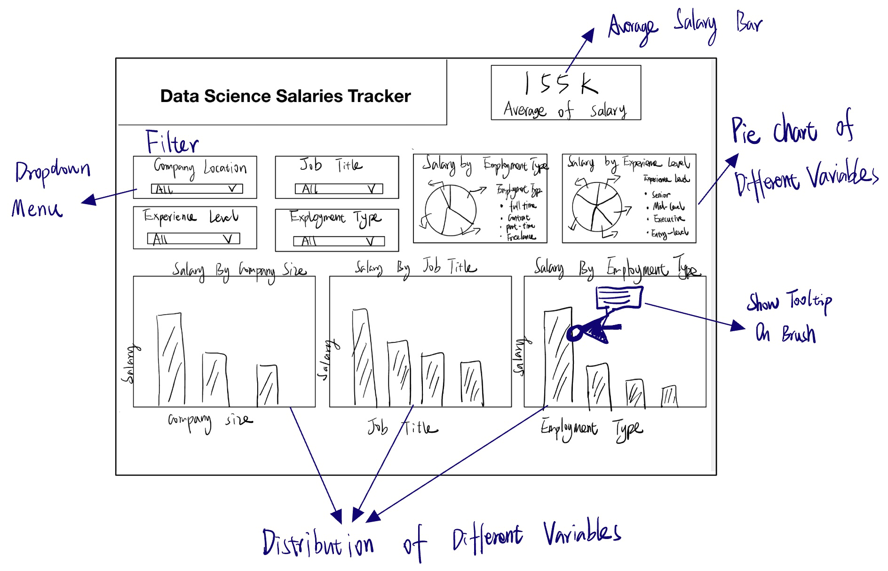

# Data Science Salaries Tracker

## Section 1: Motivation and Purpose

Our role: Data science career insights provider

Target audience: Students or professionals interested in a data science career

Choosing a career in data science can be challenging, especially when it comes to understanding salary expectations across different job titles, locations, and experience levels. Having access to reliable salary insights can help aspiring data scientists make informed decisions about their career paths, negotiate salaries effectively, and plan for future growth.

To address this challenge, we propose building a data visualization app that allows users to explore salary trends in the data science field. Our app will present salary distributions based on factors such as job title, company size, experience level, and geographical location. Users will be able to filter, sort, and compare different variables to identify trends and better understand what factors contribute to higher salaries in data science.

## Section 2: Description of data:

The dataset contains 3,755 rows and 11 columns, providing insights into Data Science job salaries across different roles, experience levels, employment types, and locations. 

The dataset includes:
- Categorical Variables: experience_level, employment_type, job_title, salary_currency, employee_residence, company_location, company_size
- Numerical Variables: work_year, salary, salary_in_usd, remote_ratio
- The primary salary variable is salary_in_usd, ensuring a standardized comparison across different currencies.

The variables can be divided into three sections which are helpful from different perspectives in order to solve the potential problems: Job Market Trends; Salary Based on Job Characteristics; Company & Geographic Influence on Salaries. 
- Job Market Trends:
    - work_year: Helps analyze salary trends over time.
    - salary_in_usd: Standardized salaries allow for accurate comparisons across different countries.
- Salary Based on Job Characteristics:
    - job_title: Enables salary comparisons across different roles
    - experience_level: Helps identify how salaries increase with experience.
    - employment_type: Distinguishes full-time, contract, part-time
- Company & Geographic Influence on Salaries:
    - company_location: Helps analyze whether companies in certain regions pay more.
    - company_size: Compares salaries in small, medium, and large companies.

Using this data we will also derive a new variable, average_year_salary, which can be derived by grouping by the year in the dataset and calculating the mean for each year. It helps us to analyze whether a person is earning above or below the average for that specific year and provides insights into salary trends over time.

## Section 3: Research questions and usage scenarios

## Section 4: App sketch & brief description

Description:

The Salary Dashboard provides an interactive analysis of Data Science job salaries, allowing users to filter by company location, job title, experience level, and employment type. Key components include visualizations of salary distribution by employment type, experience level, and company size, as well as a bar chart ranking the top 10 highest-paid job titles. The dashboard highlights average salaries while enabling dynamic exploration of salary trends across different roles and employment structures. Users can gain insights into job market patterns, helping them compare salaries and make informed career decisions.

